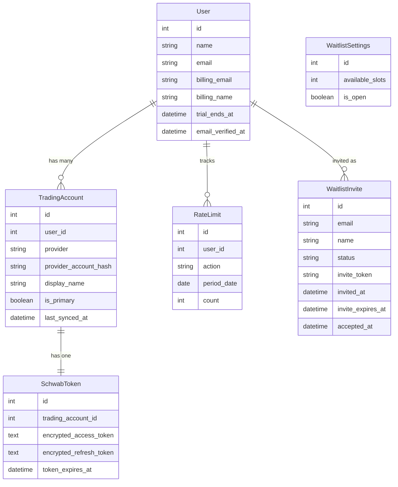

# Tendies Architecture & Implementation Plan

## Project Overview

Tendies is a trading analytics platform that provides FIFO P&L calculations and transaction analysis for retail traders. The system consists of a CLI tool (Go) and a Laravel backend that acts as an OAuth proxy for the Schwab API.

## Core Requirements

### User Experience Goals

1. **Privacy-First for CLI Users** - Allow anonymous usage without collecting personal information
2. **Flexible Profile Management** - Users can set profile after login, optional personal information sharing
3. **Waitlist System** - Controlled rollout with magic link invites
4. **Multi-Platform Support** - Support multiple trading platforms (Schwab, Robinhood, etc.) per user
5. **Freemium Model** - Free tier with rate limits, Pro tier with unlimited access

### Technical Goals

1. **Stable Identity** - Use Schwab account hash (not email) as stable identifier
2. **Account Separation** - Separate user accounts from trading accounts
3. **Trial Management** - Flexible trial periods that admins can extend
4. **Rate Limiting** - 15 queries/day for free users, unlimited for Pro/Trial
5. **Email for Billing** - Collect email only for app users, billing, and critical notifications

## Architecture Design

### Data Model




### User Types & Flows

#### 1. Anonymous CLI User (Free Tier)

**Identity:** Schwab account hash only  
**Email:** Auto-generated `{hash}@schwab.local`  
**Flow:**

```
User runs CLI → Schwab OAuth → Create TradingAccount
→ Create anonymous User → Store tokens → CLI queries API
→ Rate limited to 15/day → Can upgrade to Pro
```

**Characteristics:**

- No personal information collected
- Can use CLI indefinitely
- Subject to rate limits
- Anonymous until they access the app or upgrade

#### 2. Waitlist User (App Access)

**Identity:** Real email address  
**Email:** User-provided during signup  
**Flow:**

```
Sign up → Join waitlist → Admin sends magic link
→ Click link → Schwab OAuth → Accept invite
→ Create/Upgrade User with real email → Free trial
→ Access app + CLI → Trial expires → Choose to subscribe or downgrade
```

**Characteristics:**

- Controlled rollout via slots
- Gets free trial (7 days default)
- Real email for app notifications
- Can set billing information separately

#### 3. Returning CLI User (Already Linked)

**Identity:** Existing Schwab account hash  
**Flow:**

```
User runs CLI → Schwab OAuth → Find existing TradingAccount
→ Load User → Refresh tokens → CLI queries API
```

**Characteristics:**

- Seamless re-authentication
- Preserves existing user state
- No duplicate accounts created

#### 4. Multi-Platform User (Future)

**Identity:** Single user account  
**Multiple TradingAccounts:** One per platform  
**Flow:**

```
User has Schwab account → Add Robinhood → Connect OAuth
→ Create second TradingAccount → Link to same User
→ Query both platforms from CLI/App
```

### Authentication & Authorization

#### CLI Authentication (Passport OAuth)

```
CLI → POST /oauth/authorize → Redirect to Schwab OAuth
→ User approves → Schwab callback → Create/update user
→ Redirect to Passport OAuth → Issue token to CLI
→ CLI stores token locally → Use for API requests
```

**Token Storage:**

- CLI: `~/.config/tendies/token`
- Encrypted Schwab tokens: Database (Laravel's encrypted cast)
- Passport tokens: Standard Laravel Passport tables

#### App Authentication (Web Sessions)

```
App → Login button → Schwab OAuth → User approves
→ Callback → Create/update user → Laravel session
→ Access profile, billing, settings
```

### Rate Limiting Strategy

**Free Tier:**

- 15 API queries per day
- Tracked in `rate_limits` table per user per action per day
- Middleware: `RateLimitCli` checks count before processing
- Returns 429 with upgrade message when exceeded

**Pro/Trial Tier:**

- Unlimited queries
- Middleware skips rate limit check
- Clean upgrade path via Stripe checkout

**Implementation:**

```php
// Check rate limit
if ($user->isRateLimited()) {
    return response()->json([
        'error' => 'rate_limit_exceeded',
        'upgrade_url' => url('/pricing'),
        'remaining': 0,
    ], 429);
}

// Increment counter
RateLimit::incrementCount($user, 'api_query');
```

### Waitlist Management

**Slot-Based System:**

- Admin controls `available_slots` in `waitlist_settings`
- When slot used, count decrements
- Prevents over-onboarding

**Invitation Flow:**

1. User signs up via public endpoint
2. Status: `pending`, position tracked
3. Admin sends invite (manually via Nova or API)
4. Status: `invited`, magic link generated, expires in N days
5. User clicks link → Schwab OAuth
6. Status: `accepted`, slot decremented
7. User created with real email + trial

**Magic Link Security:**

- 64-character random token
- Stored in session during OAuth
- Validated in SchwabCallback
- Expires after N days (configurable)
- One-time use

### Profile Management

**Anonymous Users:**

- Can view profile showing `@schwab.local` email
- Limited fields (name, trading accounts)
- Message prompting upgrade for full features

**Registered Users:**

- Full profile access
- Can set billing email/name separately
- View subscription status
- Manage trading accounts
- See rate limit usage

**Billing Information:**

- `billing_email` - Where invoices are sent
- `billing_name` - Name on invoices/receipts
- Separate from account email (privacy)
- Optional until subscription required

## API Design

### Public Endpoints

```
POST   /api/waitlist/signup       - Join waitlist
GET    /api/waitlist/status       - Check position
GET    /api/health                - Health check
```

### Authenticated Endpoints (Passport)

```
GET    /api/v1/profile            - Get user profile
PATCH  /api/v1/profile            - Update profile
GET    /api/v1/accounts           - Get trading accounts [rate limited]
GET    /api/v1/transactions       - Get transactions [rate limited]
GET    /api/v1/subscription       - Get subscription status
POST   /api/v1/subscription/checkout - Create checkout session
POST   /api/v1/subscription/portal   - Access billing portal
```

### Web Routes

```
GET    /profile                   - View profile
GET    /profile/edit              - Edit profile form
PATCH  /profile                   - Update profile
GET    /auth/schwab/callback      - OAuth callback
GET    /auth/waitlist/verify      - Magic link verification
```

## Subscription & Billing

**Stripe Integration (via Cashier):**

- Monthly: $X/month
- Yearly: $Y/year (discounted)
- Trial: 7 days default (admin can extend)

**Trial Management:**

- `trial_ends_at` field on User
- Admin can set to any future date
- Checked in middleware: `$user->hasActiveTrial()`
- No auto-upgrade to paid

**Subscription Tiers:**

- **Free**: CLI only, 15 queries/day, basic features
- **Pro**: Unlimited queries, app access, priority support

## Security Considerations

### Token Security

- Schwab tokens encrypted at rest (Laravel's `encrypted` cast)
- Passport tokens follow OAuth 2.0 best practices
- PKCE flow for CLI authentication
- Tokens stored securely in database

### Privacy

- Minimal data collection for CLI users
- Email only collected when necessary
- Billing information separate from account
- No tracking of personal trading decisions

### Account Isolation

- Trading accounts scoped to users
- Rate limits prevent abuse
- Schwab account hash prevents duplicates
- Magic links expire and are one-time use

## Monitoring & Observability

**Rate Limit Tracking:**

- Daily counts per user per action
- Admin can view in Nova (when installed)
- Alerts when users hit limits frequently

**Waitlist Metrics:**

- Pending count
- Invited count
- Accepted count
- Conversion rate (invited → accepted)

**User Metrics:**

- Anonymous vs registered ratio
- Trial → paid conversion
- Active users by tier
- API usage patterns

## Scalability Considerations

**Database:**

- Indexed foreign keys
- Unique constraints on critical fields
- Composite unique index on rate_limits (user_id, action, period_date)

**Caching:**

- Schwab tokens cached in memory during request
- Rate limit counts could be cached (Redis)
- OAuth state stored in cache (database-backed)

**Background Jobs:**

- Token refresh (when near expiration)
- Waitlist email sending (queue)
- Rate limit cleanup (daily)

## Future Enhancements

### Phase 5+ (Not Yet Implemented)

- Multiple trading platform support (Robinhood, E*TRADE)
- Account merging for existing users
- Automated invite sending (when slots available)
- Custom dashboards and reporting
- Webhook notifications for trades
- Mobile app with push notifications
- Real-time portfolio tracking
- Tax loss harvesting suggestions

### Admin Features (Nova/Filament)

- Waitlist management dashboard
- User trial extensions
- Rate limit overrides
- Subscription management
- Email template editor
- Metrics and analytics

## Technology Stack

**Backend:**

- Laravel 12 (PHP 8.2+)
- MySQL/SQLite
- Laravel Passport (OAuth)
- Laravel Cashier (Stripe)
- Postmark (email)

**CLI:**

- Go 1.25+
- Cobra (command framework)
- OAuth 2.0 PKCE flow

**Infrastructure:**

- Laravel Forge (deployment)
- Cloudflare (DNS, SSL)
- GitHub (version control)
- Staging environment for testing

## Migration Strategy

**From Old Model (user → schwab_account_hash) to New Model (user → trading_accounts):**

1. Created new tables (trading_accounts, waitlist_invites, etc.)
2. Migrated existing schwab_tokens to point to trading_accounts
3. Updated SchwabService to work with TradingAccount model
4. Modified SchwabCallback to create trading_accounts
5. Added helper methods to User model for backwards compatibility
6. Tested both CLI and web flows

**Backwards Compatibility:**

- CLI continues to work without changes
- Existing tokens remain valid
- Users automatically adopted on next login
- No data loss or manual intervention required

## Testing Strategy

**Manual Testing:**

- CLI authentication flow
- Waitlist signup and invite acceptance
- Rate limiting behavior
- Profile management
- Subscription upgrades

**Automated Testing (Future):**

- Feature tests for all endpoints
- Unit tests for models and services
- OAuth flow integration tests
- Rate limit middleware tests
- Email sending tests (mocked)

## Deployment

**Environments:**

- **Local:** SQLite, development mode
- **Staging:** MySQL, Forge deployment, testing environment
- **Production:** MySQL, Forge deployment, live environment

**Deployment Process:**

1. Push to branch (staging/main)
2. Forge auto-deploys
3. Migrations run automatically
4. Cache cleared
5. Zero-downtime deployment

**Environment Variables:**

- Schwab API credentials
- Stripe API keys
- Postmark token
- Database credentials
- APP_KEY (encryption)
- Passport keys

---

## Summary

This architecture provides:

- ✅ Privacy-first CLI experience
- ✅ Controlled app rollout via waitlist
- ✅ Flexible trial and subscription management
- ✅ Multi-platform readiness
- ✅ Rate limiting for freemium model
- ✅ Separate billing information
- ✅ Scalable data model
- ✅ Clear upgrade paths

The design balances user privacy, business needs, and technical scalability while maintaining a great user experience across CLI and web interfaces.